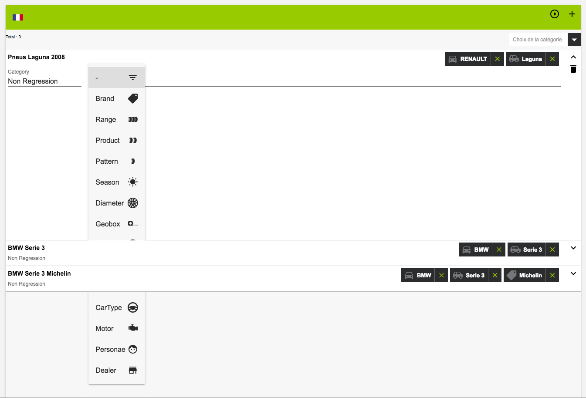
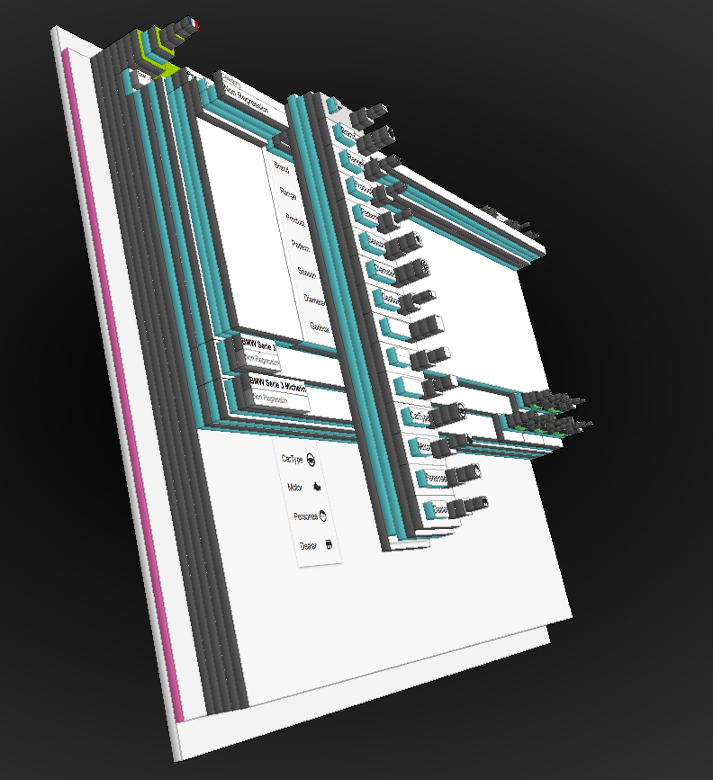

To vizualize the issue in this sample, start simple http server or liveserver (the latter doesn't like firefox)

```
python -m SimpleHTTPServer 8080
```
or 
```
live-server
```

How to reproduce
----

* navigate to http://localhost:8080
* expand one of the lines
* click on the filter list icon </img> to trigger the list-box

This is what chrome and firefox render 


When viewing the page using firefox's [tilt plugin](https://addons.mozilla.org/en-US/firefox/addon/tilt/) you can observe this 
